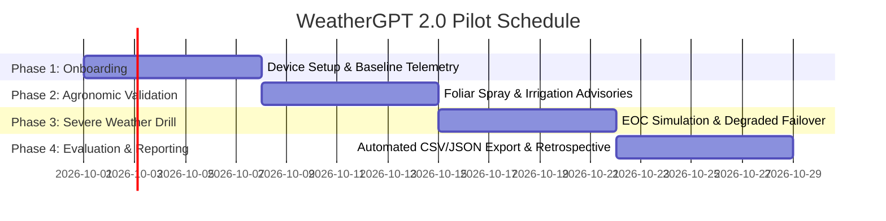

# WeatherGPT 2.0 — Stakeholder Pilot & Evaluation Plan

This document defines the operational plan for the 4-week stakeholder pilot of WeatherGPT 2.0. The pilot validates the platform with two primary target user cohorts and gathers verifiable quantitative and qualitative data for the final evaluation report.

---

## 1. Stakeholder Cohorts

### Cohort A: Smallholder Wheat & Mustard Farmers (Agricultural Producers)
- **Target Size**: 35 active participants.
- **Geography**: Punjab (Ludhiana, Bathinda, Sangrur districts) and Western Uttar Pradesh (Meerut, Aligarh, Kanpur Dehat).
- **Profile**: Operators of 2–10 acre holdings cultivating rabi crops (wheat, mustard, potato) reliant on tubewell irrigation and chemical foliar spraying.
- **Target Persona & Language**: `farmer` persona; primary UI in **Hindi (हिन्दी)** and **Punjabi (ਪੰਜਾਬੀ)**.
- **Deployment Modality**: Mobile Web PWA on low-to-mid tier Android smartphones over 4G/LTE cellular connections.

### Cohort B: District Disaster Management Authorities (DDMA) & Emergency Responders
- **Target Size**: 15 incident command officers, municipal engineers, and civil defense coordinators.
- **Geography**: Odisha Coastal Zone (Puri, Jagatsinghpur) and Bihar Riverine Basin (Patna, Bhagalpur).
- **Profile**: Field officers managing municipal emergency operations centers (EOC), flood evacuation shelters, and drainage infrastructure during active monsoon and cyclonic depressions.
- **Target Persona & Language**: `disaster_manager` persona; primary UI in **English** and **Hindi**.
- **Deployment Modality**: Desktop command dashboards and mobile field tablets.

---

## 2. Success Metrics & Quantitative Targets

Success criteria are directly anchored in the WeatherGPT 2.0 Master Product Specification and core problem statement:

| Metric Name | Target Benchmark | Cohort Relevance | Measurement Mechanism |
| :--- | :--- | :--- | :--- |
| **Direct Task Completion Rate** | $\ge 85\%$ | Farmers & Disaster Managers | Automated telemetry tracking `taskCompletion === "direct_answer"`. |
| **Query-to-Response Latency** | Median ($p50$) $< 350\text{ ms}$, $p95 < 1,200\text{ ms}$ | Both Cohorts | Real-time endpoint latency timing via `EvaluationMetricsService`. |
| **Degraded-Mode Availability** | $100\%$ uptime under simulated provider outages (0 unhandled crashes) | Disaster Managers | Telemetry tracking `taskCompletion === "degraded_fallback"` with stale warning banner. |
| **Agronomic Decision Accuracy** | $\ge 80\%$ agreement with field agricultural conditions | Farmers | Weekly field audit comparing spray drift and irrigation advice against actual ground state. |
| **Traceability Compliance** | $100\%$ of generated checklist items have verified source evidence | Disaster Managers | Automated schema validation (`traceability.sourceReference` non-empty). |
| **Forecast Accuracy (Temperature)** | $\text{MAE} \le 1.5^\circ\text{C}$ across 24h lead times | Both Cohorts | Continuous automated verification against official physical weather stations. |
| **Privacy Compliance** | $0$ PII leaks (zero names, phone numbers, or sub-km GPS logged) | Both Cohorts | Automated `PrivacyGuard` assertions on all telemetry records. |

---

## 3. Pilot Timeline (4 Weeks)

### Week 1: Cohort Onboarding & Baseline Calibration (Days 1–7)
- Deploy WeatherGPT 2.0 PWA to participant devices.
- Verify language preference toggles (Punjabi for Punjab farmers, Hindi for UP farmers and field staff).
- Collect baseline latency and device capability benchmarks via telemetry.

### Week 2: Agronomic Decision Support & Low-Bandwidth Drill (Days 8–14)
- Daily monitoring of farmer foliar spraying windows and soil irrigation guidance.
- Test offline and low-bandwidth caching during field operations.
- Initial mid-pilot feedback interviews.

### Week 3: Severe Weather Incident Command Simulation (Days 15–21)
- Trigger controlled storm/cyclone advisory drills with Cohort B (DDMA).
- Simulate upstream meteorological provider DNS outage to verify degraded-mode caching (`isDegraded: true`).
- Verify multi-agency coordination checklist completion.

### Week 4: Metrics Extraction, Verification & Evaluation Deliverable (Days 22–28)
- Extract full evaluation dataset using `/api/metrics?format=csv`.
- Reconcile forecast predictions against ground-truth meteorological station observations.
- Publish the comprehensive Evaluation Report deliverable.

---

## 4. Feedback Collection Methodology

### 1. Automated Real-Time Telemetry
- All user sessions log anonymized metrics via [EvaluationMetricsService](file:///c:/Users/HP/OneDrive/Desktop/WeatherGPT%202.0/src/services/evaluation/evaluation-metrics-service.ts).
- Captured attributes: latency (ms), task completion status, persona, language, cache hit status, and forecast vs. observed error deltas.
- Zero manual fabrication: evaluation report tables are generated directly from the `/api/metrics` export.

### 2. Structured Weekly Field Interviews
- Conducted in regional languages (Punjabi and Hindi) by field coordinators:
  - 5-point Likert scale on decision clarity ("Did the advisory help you decide whether to spray today?").
  - Cognitive load assessment: time required to find relevant information (< 30 seconds target).
  - Voice audio notes collected via WhatsApp group for qualitative sentiment.

### 3. Ground-Truth Telemetry Auditing
- Farmers' fields paired with nearest IMD / state agrometeorological rain gauges and thermometers.
- Error delta logged and reconciled automatically in the evaluation reporting view.
